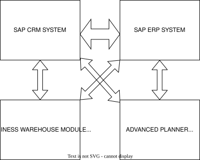

----

_To maintain confidentiality and internal security protocols, specific entity names and geographic locations have been replaced with descriptive architectural identifiers throughout this document._

----

## **Enterprise Systems Architecture: Integrated ERP and CRM Operational Frameworks**

### Introduction

The Enterprise Resource Planning (ERP) sector stands out as one of the most rapidly expanding markets within the broader software industry. Financial commitments for deploying an ERP ecosystem within an organization vary significantly, typically spanning from $50,000 to upwards of $100,000,000. Organizations choose to implement these systems to phase out legacy financial frameworks, accelerate production and process cycle times, minimize overall operational expenditures, and facilitate superior management decision-making through both real-time and online capabilities ([sumner2005foundation](References.md#sumner2005foundation)).

### Advantages and Disadvantages of ERP

The primary objective of an Enterprise Resource Planning (ERP) system is to transform information flow into a dynamic, immediate process, thereby maximizing its utility and strategic value. Fundamentally, an ERP system represents an integration of data, business partners, and suppliers that supports all major organizational functions. When deploying an ERP system, organizations face a strategic choice between two approaches: adapting their existing business processes to align with the software's native functionality, or modifying the ERP software itself to mirror their established business processes ([motiwalla2012](References.md#motiwalla2012)).

ERP systems serve as a cornerstone for institutional workflows, significantly enhancing communication and coordination across disparate business units, including accounting and finance, marketing and sales, human resources, and supply chain management. By facilitating seamless data access and cross-functional information exchange, these systems streamline operations. A closer examination of the specific advantages and disadvantages of ERP systems provides deeper insight into why organizations choose to deploy them ([adrian2015](References.md#adrian2015)).

#### ADVANTAGES

* **Secure Integration and Protected Data Access:** Ensures safe consolidation of data alongside tightly controlled, authenticated accessibility across the organization.
* **Process Standardization and Workflow Automation:** Harmonizes disparate operational workflows and automates routine business processes to maximize efficiency.
* **Enhanced Managerial Decision-Making:** Facilitates the development of deeper business insights, empowering leadership to make highly informed, strategic choices.
* **Eradication of Operational and Data Redundancy:** Cleanses the architecture by eliminating duplicate datasets and streamlining repetitive operational workflows.
* **Compression of Delivery Lead Times:** Optimizes supply chain and delivery pipelines to significantly reduce time-to-market and fulfillment cycles.
* **Comprehensive Cost Mitigation:** Drives down overhead expenditures and curtails overall operational expenses.
* **Seamless Organizational Adaptability:** Offers an agile infrastructure that easily adjusts to shifting business demands and external market dynamics.
* **Elevated Infrastructure Scalability:** Provides a flexible foundation designed to seamlessly expand alongside institutional growth and increased workloads.
* **Streamlined and Simplified Maintenance:** Reduces long-term technical debt through architectures that are straightforward to support, update, and maintain.
* **Broad Global Service Capabilities:** Expands operational reach by offering comprehensive, worldwide support networks and cross-border functionalities.
* **Unified Collaborative Dimension:** Fosters a unified environment that bridges functional silos, encouraging cross-departmental synergy and teamwork.
* **Optimization of E-Commerce and E-Business Channels:** Strengthens and accelerates digital storefronts, online transactions, and electronic business frameworks.

#### DISADVANTAGES

* **Continuous Need for System Expansion and Evolution:** Demands ongoing upgrades, scaling efforts, and iterative development to prevent technological obsolescence.
* **Prolonged Deployment Timelines:** Requires extended implementation horizons, often resulting in multi-year rollout schedules before full optimization is reached.
* **Systemic Inflexibility and Vendor Lock-In:** Risks operational rigidity due to fixed software architectures, creating heavy dependency on the chosen vendor's ecosystem.
* **Reinforcement of Rigid Hierarchical Structures:** Can inadvertently lock the organization into inflexible, highly centralized structural models.
* **Prevalence of Hidden Maintenance Expenditures:** Introduces unforeseen post-implementation financial burdens, including ongoing maintenance, licensing fees, and patch management.
* **Substantial Upfront Capital Investment:** Demands massive initial financial commitments to secure licensing, hardware, and deployment resources.
* **High Complexity and Execution Friction during Implementation:** Presents a highly intricate, challenging rollout process that often triggers internal resistance and operational disruption.

### The Best Burger Company

The Best Burger Company has no issue manufacturing its two products: Nutty Snack Bar and Fruity Cake. Its primary operational challenges are a lack of structured communication between customers and employees, un-updated inventory tracking, and financial discrepancies within accounting.

(1) **Communication Breakdown:** Internal and external communication gaps cause operational delays. For example, when a customer calls to order Nutty Snack Bars, the sales clerk manually records the order, delivery, and billing details on paper to distribute to other departments. This manual workflow introduces risks of mishearing information, illegible handwriting, and lost paperwork. These inefficiencies delay order fulfillment, risking customer defection and lost sales revenue.
(2) **Outdated Inventory Management:** Without real-time inventory updates, remaining stock levels remain unknown, increasing the risk of product expiration for these perishable goods. Accurate inventory tracking is essential for planning promotions and campaigns, and it enables employees to instantly verify product availability during customer inquiries.
(3) **Accounting and Financial Discrepancies:** The finance department lacks the immediate data required to assess cost impacts and track remaining stock. Because sales clerks fail to systematically update accountants on transactional data, the company cannot accurately calculate periodic profit and loss. Furthermore, accounting requires access to customer data to monitor credit, debit, and outstanding balances, which is necessary for determining accurate customer discount pricing.

### SAP ERP

As the new CTO hired by The Best Burger Company, I recognize the company faces sales and distribution challenges. Implementing the SAP ERP Sales and Distribution (SD) module will optimize the sales order process by utilizing a centralized database to eliminate data entry errors, track transaction history, and provide real-time updates. The system assigns unique tracking numbers to key transactions and manages the sales order process across six lifecycle stages ([monk2013](References.md#monk2013)):

(a) **Presales Activities:** Handles customer inquiries (price statements) and quotations (written offers), while maintaining customer data to generate targeted marketing mailing lists.
(b) **Sales Order Processing:** Converts inquiries or quotations into formal sales orders by recording items, prices, and quantities. The system automatically verifies the customer's credit balance and rejects orders if funds are insufficient.
(c) **Inventory Sourcing:** Runs Available-to-Promise (ATP) checks against inventory and production planning records to confirm delivery dates. If stock is unavailable in-store but present in the warehouse, the system reserves it; in cases of shortages, it automatically triggers an increase in planned production.
(d) **Delivery:** Generates the documentation required for the warehouse to pick, pack, and ship orders. It optimizes logistics by grouping similar orders by pickup requirements, shipment methods, or destination.
(e) **Billing:** Transfers sales order data into an invoice document for printing, faxing, or emailing. This automatically updates accounting records by debiting accounts receivable and crediting sales.
(f) **Payment:** Records incoming customer payments. Electronic transactions are processed automatically, while check payments are inputted manually by a clerk. The system then automatically debits cash, credits the customer's account balance, and timestamps the transaction to ensure precise future credit checks.

By analyzing the implementation of the SAP ERP system within The Best Burger Company, a sample sales order workflow can be evaluated ([monk2013](References.md#monk2013)). The following sequence outlines the operational flowchart, illustrating how orders are captured and seamlessly integrated with the accounting department:

* **SAP ERP Order-Entry Screen:** The initial interface used to record customer and product information.

* **Data Fields:** Key data fields required for entry include:
  
  * **Sold-to-Party:** The customer's unique identification number.
  
  * **Purchase Order (PO) Number:** The tracking number assigned by the customer.
  
  * **Requested Delivery Date:** The desired delivery date, which triggers system checks for availability or alternative scheduling.
  
  * **Material:** The system-assigned identification number for the requested product.
  
  * **Order Quantity:** The number of units requested.

* **Predefined Document Types:** The system uses predefined master data with unique identifiers for customers and inventory to prevent duplication. Dropdown menus remove the need for clerks to memorize IDs.

* **Customer Search Screen:** Clerks click the search icon in the "Sold-to-Party" field to open a lookup window. Searches can be conducted using criteria such as name, address, city, or phone number.

* **Customer Search Results:** The system queries the customer master database tables. Using distribution channels (e.g., direct distribution) and sales divisions narrows the search to locate the correct customer.

* **Completed Order-Entry Screen:** The point at which all necessary customer and product data fields are fully populated.

* **Order Proposals:** Once saved, the system checks production, inventory levels, and shipping times. If the requested delivery date cannot be met, the system proposes alternative delivery dates.

* **Document Flow Generation:** Acts as an audit trail by linking all document numbers associated with a sales order, allowing clerks to track whether an order is processed or shipped.

* **Pricing Conditions:** Uses an internal "condition technique" to manage and apply discount structures.

* **Discount Calculation:** The system automatically calculates volume-based discounts (e.g., a 2% discount for a $100 purchase, or a 4% discount for a $300 purchase) based on pre-programmed logic.

* **Customer Accounting Integration:** Integrates the sales and accounting modules. The document flow links directly to the customer's financial records to automatically update sales entries, track outstanding debits and credits, and run credit checks.

### CRM

Deploying an Enterprise Resource Planning (ERP) system is only the first step. To maximize organizational efficiency, focusing on the customer base is essential, which requires the utilization of Customer Relationship Management (CRM). Maintaining a robust and dependable CRM framework ensures high customer satisfaction and retention. Cultivating strong organization-to-customer relationships directly drives sales growth, ultimately increasing profitability ([hassan2014](References.md#hassan2014)).

While The Best Burger Company has adopted an ERP system to optimize its sales workflow, integrating a CRM system can further elevate operational efficiency. CRM functionality extends beyond mere relationship building; it ensures that employees remain connected with clients while maintaining centralized access to the complete history of all customer-organization interactions ([monk2013](References.md#monk2013)).

The primary activities within a CRM framework include:

* **One-to-One Marketing:** Personalizing marketing efforts and product offerings to match individual customer preferences and purchasing histories.
* **Sales Force Automation (SFA):** Streamlining the sales pipeline by automatically tracking leads, scheduling follow-ups, and managing customer contact records.
* **Sales Campaign Management:** Planning, executing, and analyzing targeted promotional campaigns to ensure maximum reach and conversion rates.
* **Marketing Encyclopedias:** Maintaining a centralized digital repository of product features, pricing matrices, and promotional materials for quick employee reference.
* **Call Center Automation:** Enhancing customer support operations through automated routing, scripting assistance, and immediate access to customer profiles during inquiries.

The SAP CRM system can be deployed to bridge customer relations with organizational operations while enabling seamless integration with the core ERP framework. As illustrated in the architecture, these systems and modules function code-dependently to maximize organizational productivity.

The SAP CRM ecosystem governs customer-facing operations across three primary areas: marketing, sales, and service. It establishes unified contact channels to maintain existing customer data while systematically onboarding new clients.

A core component of the software is marketing and campaign management, which breaks down into three distinct operational phases:

* **Planning and Budgeting:** Outlining financial boundaries and strategic milestones for current and upcoming sales cycles.
* **Campaign Execution:** Directing promotional operations to customers via multi-channel communications, including phone calls, website publications, SMS text messaging, and email.
* **Campaign Analysis:** Evaluating performance metrics to determine successes and operational bottlenecks, ensuring continuous improvement for future campaigns.

Ultimately, deploying a CRM framework provides a low-cost, high-return architecture that accelerates revenue generation and sharpens strategic performance measurement.

### Conclusion

In conclusion, an electronically integrated information infrastructure is vital to accelerating organizational productivity. Amalgamating an Enterprise Resource Planning (ERP) platform with a CRM system allows cross-functional business processes to execute automatically and deliver rapid operational results.

As established, while The Best Burger Company maintains an effective manufacturing pipeline capable of producing Nutty Snack Bars and Fruity Cakes efficiently, its lack of a centralized information system has historically capped its profitability. Consequently, as CTO, I highly recommend the deployment of the SAP ERP platform. Our structural analysis demonstrates how this system can be leveraged to accelerate workflows, enforce process consistency, and streamline the end-to-end sales lifecycle via a clear, step-by-step operational flow.

Following the implementation of the SAP ERP backbone, the logical next step to engineering an optimized sales architecture is the integration of CRM systems. The CRM framework works in tandem with SAP ERP to compound organizational value, while systematically expanding, maintaining, and updating the customer master database to guarantee high-fidelity customer service.

### References

* Adrian-Cosmin, C. 2015. “Advantages and Disadvantages of Using Integrated ERP Systems at Trade Entities.” Annals of the Constantin Brancusi University of Targu Jiu, Economy Series 4.
* Hassan, R. S., A. Nawaz, M. N. Lashari, and D. F. Zafar. 2014. “Effect of Customer Relationship Management on Customer Satisfaction.” Procedia Economics and Finance 11.
* Monk, B. J., E. F. & Wagner. 2013. Concepts in Enterprise Resource Planning. 4th ed. Concepts in Enterprise Resource Planning.
* Motiwalla, J., L. F. & Thompson. 2012. Introduction to Enterprise Systems for Management. Enterprise Systems for Management.
* Sumner, M. 2005. A Foundation for Understanding Enterprise Resource PLanning Systems. Enterprise Resource Planning.
  