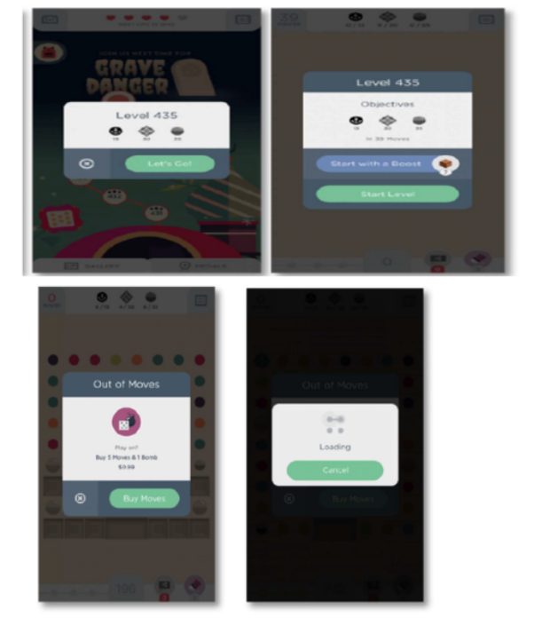
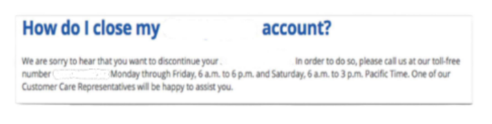
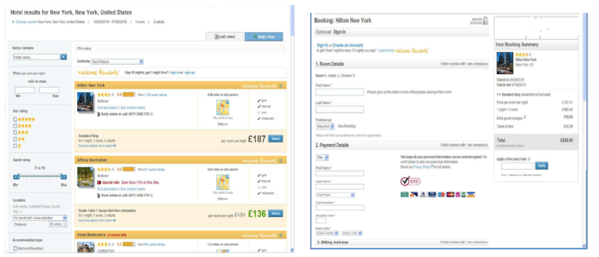

----

_To maintain confidentiality and internal security protocols, specific entity names and geographic locations have been replaced with descriptive architectural identifiers throughout this document._

----

## **Deceptive Design Architectures: An Empirical Analysis of Dark Pattern in User Interfaces**

## Introduction

Dark Patterns represent misleading user interface design practices engineered to manipulate users into making decisions they might not otherwise make. While they can occasionally be found across various digital domains, they are most prevalent on e-commerce platforms and websites requiring user registration.

Often, businesses adopt these deceptive practices under the impression that they are effective tools for customer acquisition, retention, or short-term monetization. However, these organizations fail to recognize the severe, long-term damage these tactics inflict on brand trust and customer loyalty.

This document explores three independent examples of dark patterns currently utilized by digital platforms: Universal Gaming App, Posttages.com, and Accommodations.com. Each platform will be analyzed in detail to expose its specific deceptive mechanics.

## Case Study 1 (CS1) - Misdirection - Universal Gaming App

### Operational Context (CS1)

Universal Gaming App is an entertainment software accessible primarily on mobile devices as well as Windows Operating Systems. Typically, players open gaming applications with a sense of excitement and anticipation. Because of this eager mindset, regular players routinely skim through introductory menus and setup screens out of habit. Consequently, many remain entirely oblivious to the psychological traps woven into the interface architecture.

### The Mechanism of the Trap (CS1)

During regular gameplay, users are systematically conditioned to interact with high-contrast green buttons. Upon launching the application, the user instinctively taps a green button to initiate the game. They then tap the green button twice more—first to confirm the level, and then to officially start the session.

After clicking this green button three consecutive times, the user’s cognitive momentum prepares them to either expect another standard progression button or immediately begin playing. Instead, the interface disrupts this pattern by presenting a prompt to "Buy More Moves" bound to the prominent green button, while burying the exit option inside a minuscule "X" cancel icon.

Because the user's brain has been hardwired by the immediate repetition to associate the green button with positive progression, they reflexively tap it. This tactical exploitation of habit exemplifies the dark pattern known as **Misdirection**, an approach frequently observed within mobile gaming ecosystems.

### The Dark Concern (CS1)

The primary ethical concern is that the user's choices are heavily dictated by intentional interface manipulation. The company deliberately guides the user down a specific path that financially benefits the organization at the user's expense. This issue transcends mere aesthetic choices regarding button color; it is a deliberate subversion of intent.

### The Light Recommendation (CS1)

A temporary mitigation currently built into the app occurs immediately after a user accidentally triggers the "Buy More Moves" option: the subsequent window displays a highly visible green "Cancel" button. This provides a brief window of recovery once the user realizes what has happened.

To truly resolve this issue, software developers should give all navigational options equal visual weight and introduce explicit confirmation steps:

(1) Equal Weight: Designing buttons of identical size and clarity allows users to make deliberate choices with confidence, rather than feeling tricked or misled.

(2) Confirmation Verification: A dedicated confirmation dialog allows users to review their selections and verify their trajectory before any transaction occurs.

## Case Study 2 (CS2) - The Roach Motel - Posttages.com

### Operational Context (CS2)

Posttages.com is a publicly traded American corporation (NASDAQ: STMP) providing internet-based mailing and shipping logistics. The specific dark pattern associated with this platform is known as **The Roach Motel**—a design framework where an administrative process is exceptionally easy to enter but disproportionately difficult to exit.

### The Mechanism of the Trap (CS2)

While the onboarding and sign-up processes on Posttages.com are frictionless, canceling an account is intentionally convoluted. The cancellation procedure is either deeply buried within complex submenus or entirely unlisted on the account dashboard.

The platform requires excessive friction and user effort to terminate a subscription. Specifically, the software forces users to call a toll-free number to verbally request account closure from a customer service representative. This mandatory hurdle is intentionally designed to frustrate and deter the user.

### The Dark Concern (CS2)

The ethical failure here lies in a business model that happily accommodates the user during profitable actions (registration) but creates synthetic, frustrating barriers when the relationship no longer serves the company's financial interests. Sustainable commerce requires respecting user autonomy equally throughout the customer lifecycle.

### The Light Recommendation (CS2)

The solution to this systemic friction is the implementation of transparent, concise, and visible account management options.

(1) Streamlined Offboarding: Users should be permitted to cancel their accounts through the same digital channels they used to sign up, eliminating the outdated requirement for phone calls or written manual requests.

(2) Proactive Transparency: Clear cancellation documentation or warning links should be positioned accessibly alongside or within standard user profile settings.

(3) Navigational Clarity: Contact information and termination links must be highly visible and clear, rather than obscured behind ambiguous phrasing, ensuring instructions are easy to read and effortless to locate.

## Case Study 3 (CS3) - Hidden Costs - Accommodations.com

### Operational Context (CS3)

Accommodations.com is a massive online hospitality booking platform operating 85 localized websites across 34 languages, indexing hundreds of thousands of properties worldwide. Typically, a consumer visiting this site carefully filters search results, evaluates room choices, compares pricing for their chosen destination, and proceeds to checkout under the assumption that the advertised price is accurate.

### The Mechanism of the Trap (CS3)

Deception is introduced at the final stage of the transactional pipeline. As the user fills out their payment details, the total cost undergoes a sudden, unannounced inflation. This practice is classified as the **Hidden Costs** dark pattern.

For example, a user selects a room advertised on the initial search page for $200. After investing time entering booking credentials and payment profiles, they find the final total has spiked to $300. This unexpected $100 discrepancy is attributed to accumulated taxes and unlisted service fees appended at the final second.

### The Dark Concern (CS3)

The core danger of this pattern is cognitive overload; many users fail to notice the price fluctuation in the final ledger and only realize they have been overcharged after their bank account has been debited. The platform deceptively displays isolated base rates upfront to secure the click, while relegating mandatory statutory fees to fine print or obscure corners of the page—often mimicking the layout of advertisements so the human eye naturally filters them out.

### The Light Recommendation (CS3)

The remedy for this issue is straightforward pricing transparency.

(1) All-Inclusive Upfront Pricing: The base price displayed on the primary search pages must reflect the final, legally binding total, factoring in all unavoidable taxes and surcharges.

(2) Elimination of Multi-Step Inflation: While interface designers frequently argue that these line-item breakdowns can simply be displayed in subsequent steps, providing the comprehensive total from the outset establishes true transactional honesty and maintains consumer trust without altering conversion integrity.

## Conclusion

In summary, the deceptive interface practices embedded within Universal Gaming App, Posttages.com, and Accommodations.com demonstrate how easily user autonomy can be compromised for short-term corporate metrics. Whether through the cognitive conditioning of Misdirection, the administrative friction of a Roach Motel, or the late-stage friction of Hidden Costs, these tactics prioritize immediate financial conversion over ethical user experience. Ultimately, while dark patterns may yield temporary revenue spikes, they inevitably erode consumer trust and degrade long-term brand equity. For sustainable growth, software architects and digital platforms must transition toward "light" design principles—championing transparency, equal visual weight, and frictionless user autonomy from onboarding to offboarding.
