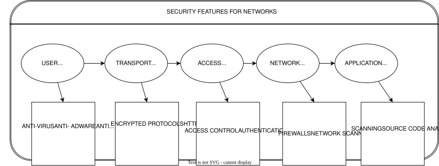
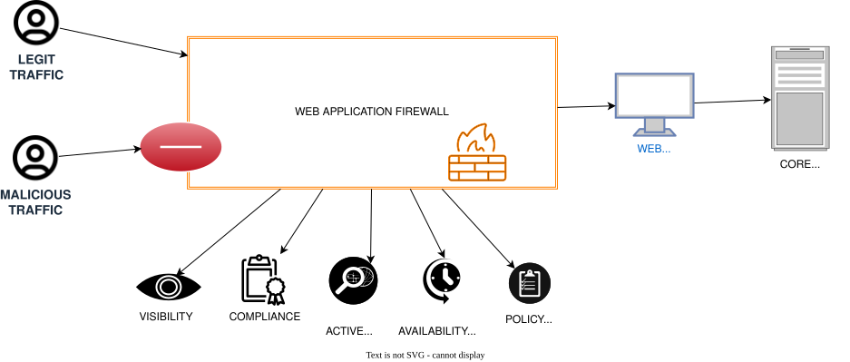

----

_To maintain confidentiality and internal security protocols, specific entity names and geographic locations have been replaced with descriptive architectural identifiers throughout this document._

----

## **Information Security Assessment: Vulnerability Management in Public Infrastructure**

### Introduction

To understand the security posture of the National Identity & Travel Credential Portal and the Enterprise Logistics & Entity Registration Suite, one must view security as a layered architecture. The following framework illustrates the multi-dimensional defense-in-depth strategy—from the user layer down to the application layer—required to safeguard data integrity.

The Regional Digital Transformation Authority, as part of its Digital Transformation Agenda, is implementing digitization projects across several public sector areas to enhance client service and eliminate corruption. These mission-critical Information Technology infrastructures require robust protection against evolving cybercrime threats, which pose significant risks such as the theft of personal confidential information and total denial of service. This assessment evaluates the information security concerns of two specific initiatives: the National Identity & Travel Credential Portal and the Enterprise Logistics & Entity Registration Suite. The analysis focuses on identifying the primary security threats targeting these applications and determining the necessary protocols to secure them effectively.

Functioning as a team of security analysts, the objective is to investigate the information security vulnerabilities, challenges, and solutions inherent to the National Identity & Travel Credential Portal and the Enterprise Logistics & Entity Registration Suite. The study is organized into three distinct sections to ensure structural integrity. Section one provides a technical description and operational overview of both the National Identity & Travel Credential Portal and the Enterprise Logistics & Entity Registration Suite. Section two addresses specific security threats, challenges, and proposed mitigation strategies. Finally, the third section provides a comparative analysis of the two projects regarding their security posture, followed by a formal conclusion.

>#### How it works for National Identity & Travel Credential Portal

The Regional Digital Transformation Authorit introduced the National Identity & Travel Credential Portal in 2017 to provide a secure and streamlined digital application service. To initiate the process, users access the official portal and establish an account using a mobile phone number and an email address. From this stage, the system facilitates two distinct workflows for obtaining documentation:

* **Offline Completion Path:** Applicants download a digital application form in PDF format. The portal integrates an electronic payment gateway, allowing users to settle application fees via mobile money or local credit cards. Upon successful payment, a voucher PIN is issued, enabling the applicant to finalize and submit the documentation to the Processing Centre.
* **Fully Integrated Digital Path:** Applicants complete the entire form directly within the online suite, execute the payment electronically, and schedule a physical appointment at the regional processing hub for final fulfillment.

>#### How it works for Enterprise Logistics & Entity Registration Suite

The Enterprise Logistics & Entity Registration Suite functions as a comprehensive, end-to-end web application platform designed to facilitate full-service business activities. This portal enables users to perform critical tasks such as business name searches, name reservations and extensions, and entity registration—with or without a Tax Identification Number (TIN)—as well as business commencement and updates to particulars. By allowing applicants to create accounts, secure name approval, process electronic payments, and print issued e-certificates, the suite directly supports the Regional Digital Transformation Authority’s objective to leverage technology to improve the ease of doing business and enhance regional competitiveness.

Developed and managed by GCNet as part of a larger e-government initiative, the suite is integrated with several key regulatory bodies to streamline the setup process:

* **Tax and Social Security Integration:** The portal is linked to regional revenue systems for the automated generation of Tax Identification Numbers and coordinates with national insurance trusts.
* **Local and Investment Oversight:** It connects with municipal assemblies for business operating certificates and works in-tandem with investment promotion councils to assist foreign entities in completing the registration process.

The operational workflow for prospective applicants involves logging into the portal using a verified digital location address. Users first conduct a search to verify the availability of their desired business name. Once the name is cleared, the system allows the user to proceed with the payment through the integrated e-payment gateway, resulting in the issuance of a digital e-certificate.

### Information Security - Vulnearbilities and Challenges

Both the National Identity & Travel Credential Portal and the Enterprise Logistics & Entity Registration Suite are web-based applications vulnerable to a wide array of cybersecurity threats and structural weaknesses. The Enterprise Logistics & Entity Registration Suite presents a higher vulnerability profile because it functions as a full-service platform integrated with multiple external databases that interact directly with the application server. In contrast, the National Identity & Travel Credential Portal primarily captures initial client data before the fulfillment process transitions to an offline environment.

General industry research indicates that web applications are frequently targeted through Content Management Systems (CMS), Software-as-a-Service (SaaS) applications, and database administration tools. Furthermore, critical vulnerabilities often stem from a lack of rigorous input/output sanitization. These flaws allow for exploitation to gain unauthorized access or the manipulation of underlying source code, which facilitates the execution of various attack vectors.

>#### SQL Injection

SQL injection represents a critical web security vulnerability where an attacker utilizes malicious code to corrupt or access backend database content. Successful exploitation allows unauthorized parties to read, create, alter, update, or delete stored data. Within the National Identity & Travel Credential Portal or the Enterprise Logistics & Entity Registration Suite, such an attack could lead to the theft of sensitive applicant personal information.

>#### Cross-Site Scripting (XSS)

The National Identity & Travel Credential Portal and the Enterprise Logistics & Entity Registration Suite are susceptible to Cross-Site Scripting (XSS) because the workflow requires redirecting users to external payment processing platforms. Attackers exploit this by injecting malicious client-side scripts, such as JavaScript, into the web application's output to manipulate browser behavior.

These XSS attacks enable adversaries to hijack user sessions, redirect applicants to malicious websites, or deface the portals. Such vulnerabilities pose significant risks to these mission-critical processes, potentially compromising the integrity of both the national identity and enterprise registration systems managed by the Regional Digital Transformation Authority.

>#### Remote File Inclusion (RFI)

Remote File Inclusion (RFI) allows an attacker to inject an external file into the web application's server. This vulnerability results in the execution of malicious scripts or code within the system, potentially leading to unauthorized data manipulation or the theft of sensitive information from the National Identity & Travel Credential Portal or the Enterprise Logistics & Entity Registration Suite.

>#### Cross-Site Request Forgery (CSRF)

Cross-Site Request Forgery (CSRF) is a malicious attack designed to deceive authenticated users into performing unintended actions. The attacker transmits a request through a website to a web application that the user is already signed into—such as the National Identity & Travel Credential Portal. By leveraging the victim’s active browser session, the attacker gains unauthorized access to the application’s functionalities.

The success of this attack relies on exploiting how the target web application manages authentication. For instance, if an individual is logged into a vulnerable site and simultaneously visits a page containing a CSRF payload, the malicious request executes as if the user intentionally initiated it; conversely, no action occurs if the user is not authenticated. In the context of the National Identity & Travel Credential Portal and the Enterprise Logistics & Entity Registration Suite, this vulnerability could redirect payments to unauthorized accounts or facilitate data theft, including the compromise of user credentials and sensitive personal information.

>#### Security Misconfiguration

Security misconfiguration encompasses all vulnerabilities resulting from a lack of diligent attention to the settings and setup of a web application. To maintain a robust defense, a secure configuration must be clearly defined and systematically deployed across the entire technical stack—including the application itself, the web and application servers, associated frameworks, the underlying platform, and the database server.

When security misconfigurations exist within the National Identity & Travel Credential Portal or the Enterprise Logistics & Entity Registration Suite, adversaries can gain unauthorized access to private information. Such lapses in oversight can ultimately compromise the integrity of the entire system managed by the Regional Digital Transformation Authority.

>#### Distributed Denial of Service (DDOS) Attacks

Distributed Denial of Service (DDoS) represents a critical vulnerability where attackers overwhelm a website, server, or network infrastructure with an immense volume of requests, malformed packets, or messages. This surge in data causes the target system to either slow down significantly or crash entirely, thereby denying legitimate users access to essential services. For the National Identity & Travel Credential Portal and the Enterprise Logistics & Entity Registration Suite, a DDoS attack can result in substantial damage to productivity, institutional reputation, and revenue generation.

DDoS attacks can also manifest through the use of malicious software (malware) that hijacks computers within a network, transforming them into "bots" to execute further attacks on other targets. In the case of the Enterprise Logistics & Entity Registration Suite, which is integrated with the networks of regional revenue systems, national insurance trusts, and municipal assemblies, a DDoS attack on any connected network could potentially spread to the main system. Such interconnected vulnerabilities carry severe consequences for both operational productivity and public trust, as service interruptions may discourage citizens from utilizing these digital platforms provided by the Regional Digital Transformation Authority.

>#### Strong Authentication and Other Access - Control Measures

This vulnerability encompasses compromised session management and broken authentication, both of which are fundamentally tied to user identification protocols. When session identifiers and authentication credentials are not rigorously protected, attackers can hijack active sessions to steal user identities. Such breaches within the National Identity & Travel Credential Portal or the Enterprise Logistics & Entity Registration Suite allow unauthorized parties to impersonate legitimate applicants.

Another critical component involves credential management attacks, which target username and password pairs to facilitate full account takeovers. Once an account is compromised, an attacker can steal, alter, or delete sensitive data, install malware, initiate unauthorized transactions, and gain expansive access to internal files and systems. According to industry research, there are four primary methods utilized to breach credentials:

1.**Unprotected Credential Storage:** This occurs when passwords are stored in plain text rather than being encrypted or hashed.

2.**Utilization of Hard-Coded Passwords:** This vulnerability involves embedding static passwords directly into the source code for inbound authentication or outbound links to external components.

3.**Insufficiently Protected Credentials:** This weakness arises when the web application transmits or stores authenticated credentials through insecure methods, leading to unauthorized interception or retrieval.

4.**Hard-Coded Credentials for Sensitive Data:** This involves using hard-coded credentials to manage cryptographic keys or passwords used for internal data encryption and outbound communications.

The Regional Digital Transformation Authority must address these structural flaws to ensure the integrity of its digital service platforms.

>#### Vulnerable Version of SSL/TLS

The National Identity & Travel Credential Portal and the Enterprise Logistics & Entity Registration Suite may be exposed to risks arising from the use of outdated versions of SSL/TLS protocols. Furthermore, the presence of vulnerable versions of other integrated web software within the infrastructure of the Regional Digital Transformation Authority can create security gaps susceptible to exploitation.

>#### Lightweight Directory Access Protocol (LDAP) Injection

In this form of attack, adversaries inject malicious code into user input fields in an attempt to gain unauthorized access or information. Successful exploitation typically leads to browser session hijacking, sensitive information theft, and the defacement of websites. This vulnerability occurs when Lightweight Directory Access Protocol (LDAP) statements incorporate client-supplied data without properly filtering out harmful code.

These attacks succeed when web applications fail to sanitize user input and output, allowing hackers to manipulate the construction of LDAP statements. Consequently, these statements execute with the same permissions as the process running the command. If successful, this can lead to significant security breaches—particularly if it grants the attacker permission to query, modify, or delete entries within the LDAP tree. By exploiting this weakness in the National Identity & Travel Credential Portal or the Enterprise Logistics & Entity Registration Suite, attackers can view usernames and passwords or even escalate their privileges to act as system administrators for the Regional Digital Transformation Authority.

>#### Rootkit Attacks

A rootkit attack involves the deployment of malicious software—such as worms, Trojans, or viruses—that effectively conceals its presence and activities from both users and legitimate system processes. By masquerading as an administrator with full privileges, the rootkit enables an attacker to assume command and control over a computer system or network without the knowledge of authorized personnel.

Once a rootkit is successfully installed within the infrastructure of the National Identity & Travel Credential Portal or the Enterprise Logistics & Entity Registration Suite, the attacker gains the ability to remotely modify system configurations, execute files, and access sensitive log data. This level of unauthorized access allows for the persistent surveillance of victim activity and poses a severe threat to the security protocols established by the Regional Digital Transformation Authority.

>#### Spoofing Attacks

Spoofing attacks occur when malicious software impersonates a legitimate user or device on a network to launch attacks against servers, facilitate the spread of malware, steal sensitive data, or bypass access controls. Industry research identifies several prevalent forms of this threat, including IP address spoofing, Address Resolution Protocol (ARP) spoofing, and Domain Name System (DNS) spoofing.

Both the National Identity & Travel Credential Portal and the Enterprise Logistics & Entity Registration Suite are exposed to these vulnerabilities. If exploited, spoofing can severely compromise the integrity, confidentiality, and availability of application resources for both the users and the Regional Digital Transformation Authority ([Veracode2019](References.md#Veracode2019)).

### Solutions for Managing Vulnerabilities-Ensuring Information Security

As a mission-critical service, maintaining robust information security for these systems is imperative. This necessity stems from the fact that both national identity credentials and enterprise registration documents serve as vital identification, enabling citizens to travel and conduct business. According to ([Imperva2019](References.md#Imperva2019)), web application security entails the comprehensive protection of websites and online services against threats and vulnerabilities embedded within the application's code. To safeguard the National Identity & Travel Credential Portal and the Enterprise Logistics & Entity Registration Suite, the following strategic steps should be implemented to mitigate vulnerabilities and ensure a secure operational environment.

>#### Information Gathering

To initiate the security protocols for the National Identity & Travel Credential Portal and the Enterprise Logistics & Entity Registration Suite, managers must first conduct a manual review of the applications. This process involves classifying all third-party hosted content and systematically identifying application entry points and client-side code structures.

>#### Vulnerability Scanning and Testing

The second step involves utilizing vulnerability scanning software and security testing tools to detect and rectify weaknesses within the National Identity & Travel Credential Portal. As cybersecurity threats become increasingly prevalent and potent, systematically checking for flaws is essential. There are two primary methodologies for testing an application after it has been commissioned:

* **Dynamic Testing:** This process analyzes code while it is running by simulating attacks and conducting penetration tests to identify and seal loopholes.
* **Static Testing:** This involves analyzing the source code during the development phase. It is particularly effective for reviewing new code changes or additions to ensure they meet security standards before deployment.

Managers of both the National Identity & Travel Credential Portal and the Enterprise Logistics & Entity Registration Suite can utilize third-party tools for on-premises scanning or leverage SaaS-based solutions. These tools are compatible with various programming languages—such as Java, PHP, and Microsoft .NET—and can be integrated into development environments. Comprehensive security activities should include manual code reviews, vulnerability assessments, and penetration testing. Furthermore, managers should specifically test authorization protocols to prevent issues like path traversals, horizontal access control failures, and insecure direct object references. Using multiple tools concurrently is recommended to provide cross-verified results and greater depth of analysis.

Addressing rootkit vulnerabilities requires a dual approach of detection and protection:

* **Detection:** Methods include behavioral analysis (monitoring for anomalous system activity), signature scanning, and memory dump analysis. If a system is compromised, the most effective remediation is often a complete system rebuild.
* **Protection:** Managers must ensure the infrastructure is constantly patched against known vulnerabilities. This includes maintaining up-to-date operating systems, application patches, and virus definitions. Regular vulnerability scanning can also assist in exposing hidden rootkits.

To mitigate Cross-Site Request Forgery (CSRF), managers must verify that every form or link contains an unpredictable, unique token for each user. Without these tokens, attackers can easily transmit malicious requests. The defensive focus should be on forms and files that handle state-changing functions. The industry-standard prevention method is to attach CSRF tokens to every request and link them to individual user sessions. These tokens must be unique to both the user session and the specific request to ensure that each action is legitimate and not originating from a malicious source.

>#### Shielding Tools

Managers should implement application shielding tools to actively protect the platforms from intrusion or significantly increase the difficulty for potential attackers. Key strategies include:

* **Runtime Application Self-Protection (RASP):** These tools serve a dual purpose as both testing and shielding mechanisms. They monitor execution, send alerts, and abort compromised or errant processes. RASP should be integrated as a core protection layer for both the National Identity & Travel Credential Portal and the Enterprise Logistics & Entity Registration Suite.
* **Code Obfuscation:** This method protects source code from being reverse-engineered by hackers and should be applied to new code additions and the existing codebase.
* **Anti-Tampering and Encryption:** These tools prevent adversaries from gaining technical insights into the underlying application logic.
* **Threat Detection Tools:** These continuously evaluate the application environment for emerging threats and the misuse of established trust relationships.

A **Web Application Firewall (WAF)** provides a robust hardware or software solution to defend against code vulnerabilities. Positioned at the network edge, it acts as a gateway that inspects all incoming traffic and blocks malicious requests—compensating for any deficiencies in manual code sanitization. WAFs utilize constantly updated signature pools to identify known attack vectors and can be customized to align with institutional security policies. By utilizing behavioral and reputational learning, the WAF can be integrated with other solutions, such as DDoS protection, to create a comprehensive security perimeter.

A primary example of an application shielding tool is the Web Application Firewall (WAF). Unlike standard firewalls, the WAF is specifically engineered to filter, monitor, and block HTTP/HTTPS traffic to and from the web application. As shown in the diagram below, it serves as a critical checkpoint that distinguishes between legitimate user traffic and malicious requests, ensuring that only sanitized data reaches the core infrastructure of the Regional Digital Transformation Authority.

To prevent **LDAP injections**, a combination of defensive programming, complex input validation, and static/dynamic analysis is required. All incoming data must be sanitized to remove malicious scripts or characters, while outgoing validation adds a secondary security layer for the user. Additionally, tight access controls must be configured on the LDAP directory itself.

Regarding **Cross-Site Scripting (XSS)**, prevention is achieved through code testing tools. For existing vulnerabilities, managers should utilize tools that monitor and validate all inputs. Given the rising frequency of XSS attacks, transitioning to a third-party SaaS security service is recommended for specialized prevention.

Finally, to mitigate **spoofing attacks**, managers should focus on these four critical measures:

1.**Packet Filtering:** Utilizing filters to scrutinize network transmissions. This prevents IP spoofing by blocking packets with conflicting source addresses (e.g., external addresses appearing to originate from inside the network).

2.**Avoiding Trust Relationships:** Protocols that rely solely on IP addresses for authentication should be avoided, as they are easily exploited by spoofing tools.

3.**Spoofing Detection Software:** Implementing scanning programs—particularly for ARP spoofing—that inspect and certify data before transmission and block suspected spoofed packets.

4.**Cryptographic Network Protocols:** Deploying encrypted communication protocols such as TLS, HTTPS, and SSH ensures that data is encrypted before leaving the network and authenticated upon arrival.

>#### Denial of Services

To enhance the resilience of the National Identity & Travel Credential Portal and the Enterprise Logistics & Entity Registration Suite against denial of service threats, managers should implement rigorous testing for account lockout vulnerabilities, anti-automation bypasses, SQL wildcard DoS, and HTTP protocol DoS. When these testing protocols are integrated with the specialized filtering capabilities of a Web Application Firewall (WAF), the platforms can be effectively shielded from both distributed denial of service (DDoS) and high-volume DoS attacks.

>#### Enforcement of Web Application Security Solutions

The Regional Digital Transformation Authority must prioritize the enforcement of robust web application security solutions and standardized security procedures, particularly the Payment Card Industry Data Security Standard (PCI DSS), to safeguard the payment processing components of its digital platforms.

PCI DSS comprises a specialized set of security requirements designed to protect debit and credit card transactions from fraud and unauthorized data exfiltration. Since both the National Identity & Travel Credential Portal and the Enterprise Logistics & Entity Registration Suite process financial transactions, obtaining PCI DSS certification is essential. This certification mandates several critical security layers, including:

* **Installation of Firewalls:** Creating a secure barrier between the internal network and external traffic.
* **Encryption of Data Transmissions:** Ensuring that sensitive financial information is unreadable during transit across open networks.
* **Deployment of Antivirus Software:** Maintaining up-to-date protection against malicious code.

Adherence to these standards is vital for preventing data breaches, which would otherwise severely disrupt the operational integrity and public utilization of these mission-critical applications.

>#### Keeping Software Upto Date

To maintain the structural integrity of the National Identity & Travel Credential Portal and the Enterprise Logistics & Entity Registration Suite, managers must implement a rigorous and consistent software update schedule. Because adversaries specifically target known security flaws within web-based software, regular updates across the entire tech stack ensure that all identified security vulnerabilities are systematically patched, reinforcing the overall defense of the Regional Digital Transformation Authority's digital infrastructure.

>#### Enforcing Strong Password Policy

To uphold the security standards of the National Identity & Travel Credential Portal and the Enterprise Logistics & Entity Registration Suite, managers must ensure that all system passwords are original and not those supplied by default by vendors. Given that attackers frequently employ sophisticated software to aggressively crack weak credentials, the implementation of a robust password policy is essential.

This policy should mandate the use of complex passwords that are at least 10 characters in length and incorporate a combination of the following:

* **Uppercase and lowercase letters**
* **Numerical digits**
* **Special characters**

By enforcing these requirements, the Regional Digital Transformation Authority can significantly reduce the risk of unauthorized access through credential-cracking attempts.

>#### Using Secure Servers

Managers must ensure that the server environments and hosting infrastructures utilized for the National Identity & Travel Credential Portal and the Enterprise Logistics & Entity Registration Suite are rigorously secured. Protecting the underlying hardware and virtual environments where these applications reside is fundamental to maintaining the operational integrity of the Regional Digital Transformation Authority.

>#### Keeping Website Interface Clean

To maintain the security of the National Identity & Travel Credential Portal and the Enterprise Logistics & Entity Registration Suite, managers must ensure that the digital environments remain streamlined and "clean." Every redundant database, file, or plugin serves as a potential entry point for adversaries.

To mitigate these risks, it is essential to decommission and delete any databases, applications, or files that are no longer functionally relevant. By removing these extraneous components, the Regional Digital Transformation Authority can maintain an organized file structure and minimize the attack surface available to unauthorized parties.

>#### Regular Data Backup

To ensure the resilience of the National Identity & Travel Credential Portal and the Enterprise Logistics & Entity Registration Suite, managers must implement a consistent backup strategy for all server-side data and application files. These backups can be executed manually or through automated scheduling. By maintaining regular archives of the system's state, the Regional Digital Transformation Authority can ensure that critical applications are restored and made operational immediately following a security breach or successful cyberattack.

>#### Hiring Security Experts and Putting in Place a Security

To maintain the architectural integrity and operational security of the National Identity & Travel Credential Portal and the Enterprise Logistics & Entity Registration Suite, managers must establish a formal relationship with cybersecurity specialists. This can be achieved either by maintaining a dedicated in-house security team or by outsourcing requirements to a specialized cybersecurity firm.

Engaging with experts ensures the consistent execution of several critical security protocols for the Regional Digital Transformation Authority, including:

* **Continuous Vulnerability Scanning:** Systematically identifying new weaknesses within the application stack.
* **Frequent Security Audits:** Performing comprehensive reviews to ensure compliance with established security standards.
* **Active Monitoring:** Overseeing the network for any signs of malicious or anomalous activity.
* **Remediation and Repair:** Executing necessary technical repairs and system hardening as requirements emerge.

>#### Information Security Policy

It is essential for the Regional Digital Transformation Authority to implement a comprehensive information security policy developed by industry experts. This policy serves as a foundational guide for managing the security lifecycle of both the National Identity & Travel Credential Portal and the Enterprise Logistics & Entity Registration Suite, specifically addressing the protection of assets and the remediation of attacks.

The policy formally establishes protocols for the continuous scanning and testing of both new and legacy codebases to ensure no vulnerabilities are introduced. Furthermore, it encompasses all web application assessments required to maintain a robust security posture, facilitate proactive risk management, and govern changes in the control of technologies utilized by both platforms.

By clearly defining the responsibilities for conducting security assessments, the distribution of technical reports, and the specific actions required for remediation, the policy ensures that the Regional Digital Transformation Authority remains compliant and that its digital applications are shielded from evolving security challenges and vulnerabilities.

### Conclusion

This paper examines the integration of security into two critical digital platforms—the National Identity & Travel Credential Portal and the Enterprise Logistics & Entity Registration Suite—addressing instances where security may have been treated as an afterthought. Both systems are central to the Regional Digital Transformation Authority’s initiative to digitize public services, improve operational efficiency, and eliminate corruption under the World Bank-sponsored e-governance project.

The first section of this paper analyzes the operational mechanics of these two applications. This is followed by a comprehensive evaluation of the vulnerabilities threatening these platforms, including:

* **Injection & Scripting:** SQL Injections, LDAP Injections, and Cross-Site Scripting (XSS).
* **Access & Authentication:** Spoofing, vulnerable SSL/TLS versions, and deficiencies in strong authentication or access-control measures.
* **Exploits & Forgery:** Rootkit attacks, Cross-Site Request Forgery (CSRF), and Remote File Inclusion.
* **Service Integrity:** Distributed Denial of Service (DDoS) attacks and general security misconfigurations.

To mitigate these risks, the following strategic recommendations were proposed to the managers of the Regional Digital Transformation Authority:

1.**Proactive Assessment:** Continuous information gathering, vulnerability scanning, and rigorous testing.

2.**Shielding Technologies:** Implementation of specialized tools, specifically **Web Application Firewalls (WAF)**.

3.**System Hygiene:** Maintaining an organized and "clean" website environment, keeping all software up to date, and performing regular data backups.

4.**Governance & Expertise:** Establishing a formal information security policy, enforcing strong password requirements, and engaging either a dedicated in-house security team or external cybersecurity experts.

### References

* Imperva. 2019. What Is Web Application Security. <https://www.imperva.com/learn/application-security/application-security/>.
* Veracode. 2019. What Is CSRF? <https://www.veracode.com/security/csrf>.
  