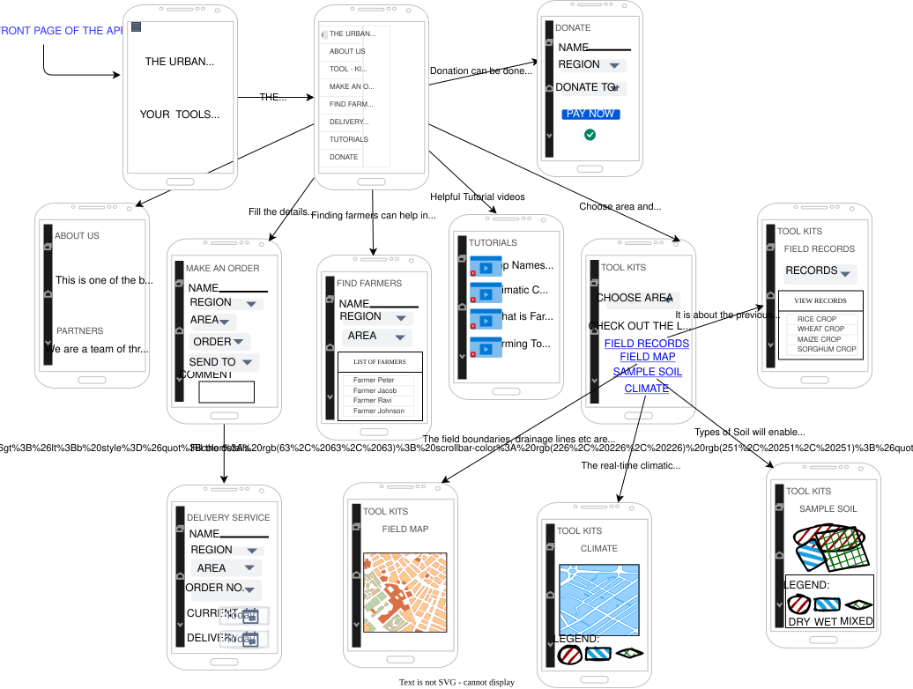

----

_To maintain confidentiality and internal security protocols, specific entity names and geographic locations have been replaced with descriptive architectural identifiers throughout this document._

----

## **Agro -Kit: Integrated System Architecture & Solution Design**

### Why Agro-Kit?

The Agro-Kit matters in Ghana, because the link between middle-class people and their food security is remarkably strong. Especially for communities from disadvantaged milieus, this poses an essential problem. The access is very selective. Agro-Kit wants to encourage all the humans on their way to a healthier food and contribute to them finding out about the cooking with own cultivated food so that they start living accordingly.

### Our vision

#### Sustainable effects for middle class humans, families, and society as a whole

We envision and work towards a society in which food security is irrespective of the social milieu and where cultivating own food is every person’s reality. A society in which social connections exist beyond and between established milieus and where everybody is able to unfold their gardening potential.

### Our program & business model

#### Ordering and Greenhouse planting in one App: comprehensible and effective

Customers will order their kits through an app, and the company will deliver the kit. The app will also contain tutorials and workshops by expertise that help clients to maximize their advantages and opportunities of having a greenhouse; and a list of farmers that can help them with the maintenance. Though this, we create jobs as well. With the incomes that the company will have, a percentage of it will be used to develop greenhouses in communities for free or as cheap as it can be. Zero hunger and food security are part of the main goals to develop according to the SGDs and is a problem that mostly all the Global South cities have.
Our product will cover the triple-bottom line that sustainable development has, and in addition create a greater business value.

1. In the economic factor; we are implementing a business idea that can give us profit and can be an employment source for people.

2. In the social factor; we are going to give resources to communities so they can improve their food security and also empower the women, who sometimes are lagging or have been excluded.

3. In the environmental factor; the use of greenhouses can help to reduce the waste of food and at the same time decrease the pollution in the environment with a better production of the food.

Our growth is carried from a nationwide to an international cultivating movement.

"The below diagram shows the Agro -Kit App & Business Model"

