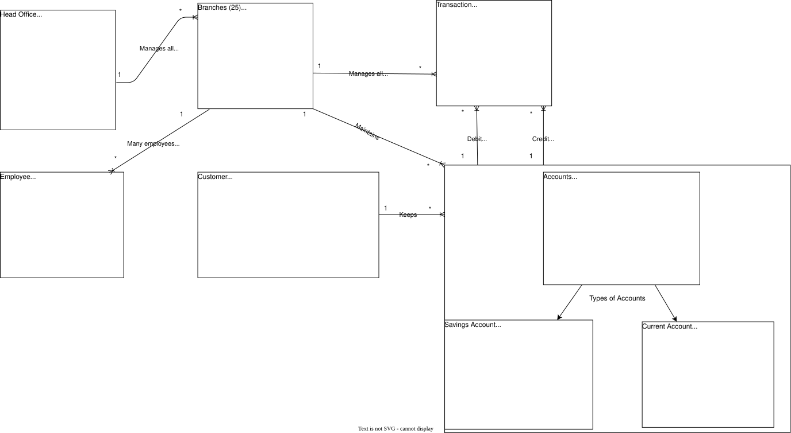
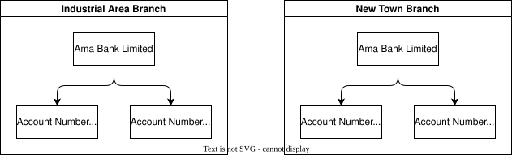
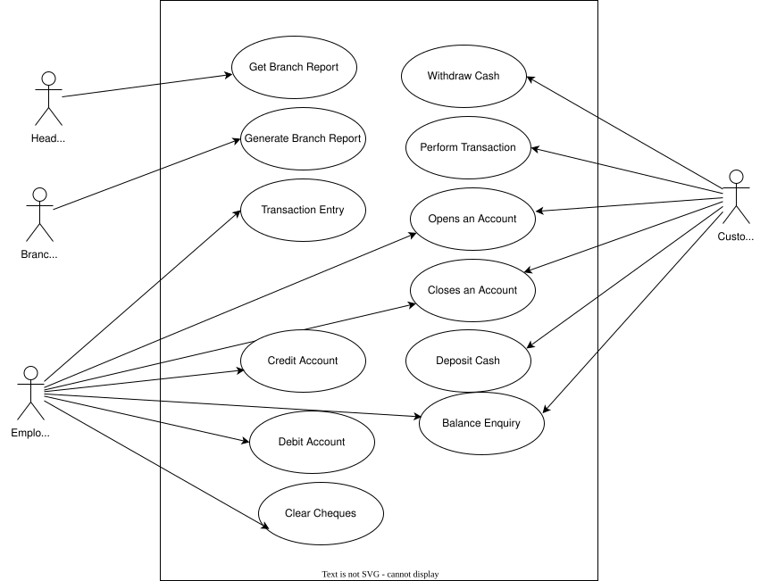
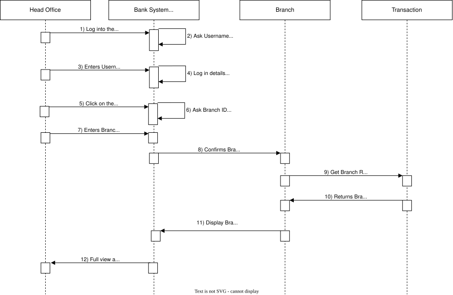
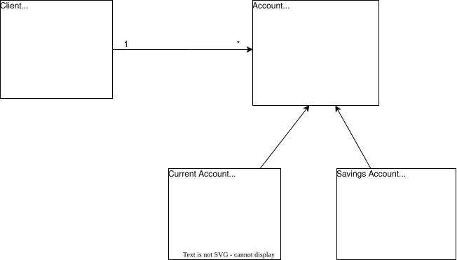
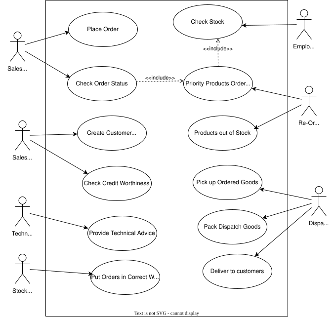

----

_To maintain confidentiality and internal security protocols, specific entity names and geographic locations have been replaced with descriptive architectural identifiers throughout this document._

----

## **Object-Oriented System Modeling: Unified Modeling Language (UML) Specification**

### Introduction

In the Object-Oriented methodology, the focus is on encapsulating the architecture and behavior of information systems into modular components that integrate both data and processes. The fundamental goal of Object-Oriented Design is to improve the standard and productivity of system analysis and design by increasing its overall functionality ([tutorialspoint2019object](References.md#tutorialspoint2019object)).

The Unified Modeling Language (UML) utilizes graphical representations in the form of diagrams. Consequently, a UML diagram provides a specific perspective of the reality modeled by the system. Certain diagrams define which users interact with specific functionalities, while others describe the system's architecture, all without necessitating a specific implementation. UML diagrams are categorized into two primary groups: Structure Diagrams and Behavior Diagrams ([martina2012](References.md#martina2012)).

* Structure Diagrams include: Class Diagrams, Package Diagrams, Object Diagrams, Component Diagrams, Profile Diagrams, Composite Structure Diagrams, and Deployment Diagrams.

* Behavior Diagrams comprise: State Machine Diagrams, Use Case Diagrams, Activity Diagrams, and Interaction Diagrams—which further include Sequence Diagrams, Interaction Overview Diagrams, Communication Diagrams, and Timing Diagrams.

This Document aims to utilize UML diagrams for two specific case scenarios: Ama Bank Limited and Rosy Servises.

### Object Model

Based on the provided case study, the central hub for operations is a financial institution situated in the busy area named Titan, identified as Ama Bank Limited. This organization maintains twenty-five distinct branches throughout Ghana, all of which maintain a persistent connection to the central office. To streamline and govern their internal business operations, the bank has commissioned the engineering of a specialized software solution.

Serving as the project lead, I have been tasked with the architectural delivery of an Object Model and an Instance Diagram for the institution. The core operational logic of the bank involves the central office synchronizing transactions and managerial oversight across the twenty-five branches. These transactions primarily consist of credit and debit actions performed on accounts at the branch level. Within this system, customers possess two primary account classifications: Savings Accounts and Current Accounts.

### The Role of Object Modeling in System Engineering

In the Unified Modeling Language (UML) framework, an Object Model provides either a comprehensive or a partial structural view of a modeled system at a precise moment in time. It serves as the blueprint for the instances within a system and the specific associations linking them. The Object Diagram specifically captures the state and behavior of an Object once it has been instantiated. These diagrams are vital for documentation because they simplify the visualization of complex functional requirements ([geeksforgeeks2019uml](References.md#geeksforgeeks2019uml)).

The utility of an Object Model in the analysis and design phase is driven by several key factors:

* **Instance Illustration:** It provides a concrete representation of system architecture using representative instances and authentic data points.
* **Functional Clarity:** It assists in identifying and validating the specific functionalities intended for end-user delivery.
* **Relational Visualization:** It offers a transparent view of the interconnectedness between various objects.
* **System Lifecycle Support:** It facilitates the visualization, design, construction, and formal documentation of the system's structural integrity.
* **Validation:** Object diagrams act as a testing mechanism to verify that class diagrams are both accurate and complete.

In alignment with these principles, an Object Diagram and an Instance Diagram have been engineered for Ama Bank Limited. Both visual artifacts follow the methodologies proposed by ([collins2018object](References.md#collins2018object)). These diagrams delineate a validated object model where the central office regulates the transactional and managerial flow of the twenty-five branches.

Furthermore, the model illustrates the transactional cycle—comprising debits and credits—executed across the branch network. The two account categories owned by customers are synthesized through UML generalization, where Savings and Current accounts are grouped under the parent entity, "Accounts." In the resulting diagrams, the "Accounts" class is partitioned into Current and Savings specializations. For the purpose of maintaining a clear two-dimensional structural representation, the twenty-five branches are consolidated into a singular representative branch entity.

> The following details the structural logic and associations within the Object Model for Ama Bank Limited:
>
> * **Centralized Management:** The central office maintains oversight of the twenty-five branches. The "1" adjacent to the Head Office indicates a singular administrative authority, while the "*" adjacent to the Branch signifies that the entire branch network is governed by that single central entity.
> * **Personnel Distribution:** Multiple employees are assigned to a specific branch. The "*" near the Employee indicates that a large workforce belongs to each individual branch, while the "1" on the Branch side of the node confirms that one branch houses many employees.
> * **Transactional Oversight:** The "1" near the Branch and the connecting "*" near Transaction indicates that every individual branch is responsible for managing its respective volume of transactions.
> * **Account Maintenance:** The "1" adjacent to the Branch and the "*" adjacent to Accounts signifies that each branch maintains the integrity and records of all accounts under its jurisdiction.
> * **Customer Ownership:** A single customer is permitted to hold multiple accounts, represented by the "1" near the Customer and the "*" at the Accounts connecting point.
> * **Debit Operations:** The model illustrates that many transactions are processed as debits, flowing from the "*" Transaction entity to a singular "1" Account.
> * **Credit Operations:** Similarly, many transactions are processed as credits, directed from the "*" Transaction entity to a specific "1" Account.
> * **Structural Generalization:** Utilizing the principle of generalization, the specialized Current Account and Savings Account entities are derived from the primary Account class. The triangle-headed arrows serve as the formal notation for this hierarchical generalization.

### Instance Diagram Showing Branch and Accounts Objects

Consequently, as demonstrated in the aforementioned object model, for a task to execute between objects within a specific timeframe, a link must be established between two class instances. The instance diagram provided below illustrates the specific relationships existing between the Branch and Account objects.

To interpret the following illustration, an instance of the Branch class is associated with multiple instances of the Account class. Conversely, a single instance of the Account class is associated with exactly one instance of the Branch class. As depicted in the diagram, the Ama Bank Limited Industrial Area Branch (an instance of the Branch class) maintains a link with two specific instances of the Account class: account numbers 100123 and 201005. This same logic applies to the interpretation of the Ama Bank Limited New Town Branch.

### Use Case Diagram - Ama Bank Limited

A Use Case specifies a particular segment of required functionality within an application system. Formulated during the analysis phase, it illustrates the various interactions between an actor and the system. An actor may be a human user, a software component, or hardware. Notably, the use case defines the "what" rather than the "how," omitting the internal technical implementation ([brahma2015basics](References.md#brahma2015basics)).

The advantages of utilizing use cases include ([elenburg2005use](References.md#elenburg2005use)):

* **Contextual Depth:** They provide a comprehensive context for functional requirements.
* **Behavioral Communication:** They effectively capture and convey the intended system behavior.
* **Stakeholder Alignment:** They are intuitive, which facilitates consensus among stakeholders.
* **Iterative Planning:** They serve as a robust planning instrument for iterative development cycles.
* **Design Abstraction:** They prevent premature design by detailing system requirements without dictating implementation methods.
* **Scope Management:** They help mitigate scope creep by clearly defining the boundaries of interaction between actors and the system.

In a similar fashion, the Use Case diagram above demonstrates the operational workflow at Ama Bank Limited. The identified actors are the Head Office, Branch Manager, Employee, and Customer. The interactions are defined as follows:

>**(a) Head Office:** This entity has the authority to request and access reports from any of the twenty-five branches.
>
>**(b) Branch Manager:** The manager assigned to a specific branch is responsible for generating that branch's localized reports.
>
>**(c) Employee:** Bank staff execute various operational tasks. These include assisting customers with opening or closing accounts, balance inquiries, crediting and debiting accounts, clearing cheques, and performing transaction entries.
>
>**(d) Customer:** This actor engages in primary transactions such as withdrawing or depositing cash, opening or closing accounts, and checking account balances.

### Sequence Diagram

The Sequence diagram below portrays the steps the head office will follow to get branch report. The steps are:

(1) The officer at the Head office will have to login to the server.

(2) The bank server will ask for username and password

(3) The officer enters the username and password

(4) The server confirms the login details

(5) The officer clicks on the Reports Button

(6) The server requests for Branch ID and Branch Name

(7) The officer enters the desired Branch ID and Branch Name

(8) The server confirms the Branch ID and Branch Name and establishing the connecting port to the appropriate Branch.

(9) Then the officer retrieves the branch report by selecting “Get Branch Report”

(10) The branch sends all the transaction of the branch in a report form

(11) The server displays the branch report

(12) The officer gets a full view of the report and can print it. The print in the sense, can print to pdf or make a hardcopy print. This is the end of the process.

A class diagram is a static blueprint categorized as a structural diagram. Notably, class diagrams represent the only UML model that can be directly and seamlessly mapped to object-oriented programming languages. They visually organize a collection of classes, associations, collaborations, interfaces, and system constraints. While class diagrams are extensively utilized for visualizing, specifying, and documenting various dimensions of a system, they also serve a critical role in forward-engineering executable code for software applications. Furthermore, they formally define the attributes, operations, and constraints imposed on the system architecture ([tutorialspoint2019uml](References.md#tutorialspoint2019uml)).

The advantages of utilizing class diagrams include ([guru2019uml](References.md#guru2019uml)):

* **Schematic Clarity:** They facilitate a superior understanding of the general schematics and structural layout of an application.
* **Data Modeling:** They accurately illustrate complex data models for large-scale information systems.
* **Maintenance Efficiency:** They aid in reducing long-term system maintenance time by providing clear documentation.
* **Code Abstraction:** They offer a high-level conceptual understanding of how the application is structured prior to analyzing the actual source code.
* **Development Guidance:** They support the creation of detailed architectural charts by highlighting the exact code components required for implementation.

The diagram below illustrates the structural relationship and communication path between the "Client" and "Account" classes. For these two entities to interact, a formal link must be established, which is represented as an association. This association is depicted as a solid line connecting the two classes, featuring an arrow that indicates the direction of navigation.The structural logic of this illustration is interpreted as follows: a single client instance ("1") is associated with, and can possess, multiple account instances ("*").

Building upon the structural foundation established in the class diagram, the architecture has been further mapped to an object-oriented UML diagram. The illustration below captures the specific arrangement for the "Checking Account" and "Savings Account" classes.

These two specialized classes inherit core properties and behaviors from the broader parent class, "Account," through the principle of generalization. Generalization defines a taxonomic relationship that connects a specialized element to a more generalized element, thereby facilitating a clear hierarchical structure. In the diagram below, the triangle-headed arrows directed from both the checking and savings account classes toward the main Account class formally denote this generalization relationship.

The above UML model serves as an effective Computer-Aided Software Engineering (CASE) tool, as it provides a standardized graphical representation for object-oriented programming. It actively supports the planning and visualization phases of software development. Furthermore, it has consistently proven to be an ideal choice for developers across a wide range of functional applications due to its inherent readability and component reusability.

The primary objective of UML is to deliver a transparent, visual depiction of the relationships existing between distinct classes and entities. This clear representation simplifies the process of understanding the specific behavior of each class object, how information is structured and stored, and the architectural connections maintained with other classes throughout the program ([friesen2019advantages](References.md#friesen2019advantages)).

### Use Case Diagram - Rosy Services

Rosy operates an enterprise named Rosy Servises and intends to systematize its sales procedures. Inventory is purchased in wholesale quantities from various vendors and resold to consumers for a profit. The sales unit at Rosy Servises employs a diverse workforce. A standard salesperson can generate orders based on customer requests and monitor order status. A technical salesperson shares these identical responsibilities but is also qualified to provide technical advice to clients. A sales supervisor is responsible for establishing new customer accounts and conducting creditworthiness evaluations. A dispatcher handles the retrieval of ordered inventory from the warehouse and packages the items for customer shipment.

To optimize this workflow, the software system must generate a list of unpacked orders and dynamically remove orders from the active queue once they are dispatched. All employees within the facility require system access to review real-time details regarding current stock levels, customer orders, and specific warehouse locations. A re-ordering clerk is responsible for identifying out-of-stock items and procurement from manufacturers. If specific goods are urgently required to fulfill a pending order, they are classified as "priority" products to ensure immediate procurement. The system must automatically flag and recommend these "priority" items to the re-order clerk. Finally, a stock clerk receives incoming manufacturer shipments and organizes them within the warehouse. A use case diagram is utilized below to illustrate the operational architecture of Rosy Servises.

To interpret the aforementioned use case diagram:

The actors identified within this use case model must operate in an integrated pipeline, spanning from the initial receipt of a customer order to the final delivery of the product. While the diagram successfully maps the discrete functional capabilities of each actor, representing the sequential dependencies and explicit connections between their respective tasks introduces modeling complexity in a standard use case format.

The specific functional interactions are defined as follows:

>* **(a) Place Order:** A salesperson generates and assigns a product order based on a specific customer request.
>* **(b) Check Order Status:** The salesperson monitors the fulfillment state of a customer's order. This use case enables the salesperson to flag the re-order clerk to prioritize missing items, maintaining optimal warehouse inventory. Within the diagram, this dependency is represented by a dashed arrow with the `<<include>>` stereotype directed from the "Check Order Status" use case to the "Priority Products Ordering" use case.
>* **(c) Create Customer Account:** The sales supervisor executes the registration process for new customer profiles.
>* **(d) Check Credit Worthiness:** The sales supervisor evaluates the customer’s credit standing to authorize or restrict order placement.
>* **(e) Provide Technical Advice:** The technical salesperson delivers specialized technical guidance to customers regarding product specifications.
>* **(f) Check Stock:** The employee queries the system to verify current inventory availability within the warehouse.
>* **(g) Priority Products Ordering:** The re-order clerk isolates and processes procurement files that require immediate fulfillment. This use case receives two incoming dashed arrows stereotyped with `<<include>>` originating from both "Check Stock" and "Check Order Status".
>* **(h) Products Out of Stock:** The re-order clerk audits inventory levels to distinguish between available and depleted product lines.
>* **(i) Put Orders in Correct Warehouse:** A stock clerk receives incoming manufacturer shipments and allocates them to their designated warehouse locations.
>* **(j) Pick Up Ordered Goods:** The dispatcher retrieves the specified inventory items from the warehouse floor.
>* **(k) Pack Dispatch Goods:** The dispatcher packages the retrieved items, preparing them for transit.
>* **(l) Deliver to Customers:** The dispatcher executes the final transit phase, delivering the packaged goods to the end consumer.

### Object Oriented and Case Tools

The significance of Object-Oriented Analysis and Design (OOAD) in managing system requirements includes the following ([tutorialspoint2019ooad](References.md#tutorialspoint2019ooad)):

* **Data-Centric Focus:** It prioritizes the structure and integrity of data over the procedural methods emphasized in traditional structured analysis.
* **Encapsulation Security:** The core principle of encapsulation enables developers to build isolated, secure components, preventing unintended tampering from other parts of the system.
* **Complexity Management:** It provides a robust framework for managing software complexity more efficiently.
* **Scalability:** It facilitates a smooth evolutionary path, allowing a system to scale from a small-scale architecture to a large enterprise application.

Computer-Aided Software Engineering (CASE) refers to the application of automated methodologies and digital tools throughout the software development lifecycle. CASE ensures the delivery of high-value, reliable, and defect-free software applications. By maintaining a disciplined development framework, it assists designers, developers, and testers in remaining aligned with the core project objectives during production. Ultimately, CASE encompasses a wide range of productivity tools that optimize developer effort, establish a clean structural architecture for projects, and maximize operational throughput   ([pankaj2019case](References.md#pankaj2019case)).

The four primary advantages that CASE tools offer to system development process models are:

* **Enhanced Product Quality:** The overall standard of the software is elevated due to the structured, systematic approach enforced during development.
* **Real-World Alignment:** It bridges the gap between theoretical specifications and real-world functional requirements through automated engineering processes.
* **Competitive Advantage:** It provides organizations with a market lead by ensuring the consistent deployment of high-tier, dependable products.
* **Reduced Maintenance Costs:** Long-term servicing and maintenance expenses are significantly minimized because specific emphasis is placed on early testing and structural redesign.

### References

* Ankit, J. 2019. Unified Modeling Language (UML) | Object Diagrams. <https://www.geeksforgeeks.org/unified-modeling-language-uml-object-diagrams/>.
* Brahma, D., and R. Sarnath. 2015. Basics of Object-Oriented Programming. In: Object - Oriented Analysis, Design and Implementation - an Integrated Approach. Springer.
* Collins-Cope, M. 2018. “Object Oriented Analysis and Design Using UML.” In Whitepaper.
* Elenburg, D. 2005. “Use Cases: Background, Best Practices and Benefits.” In MKS White Paper.
* Friesen, M. 2019. List of Advantages of UML. <https://www.techwalla.com/articles/list-of-advantages-of-uml>.
* G., Guru. 2019. UML Class Diagram Tutorial with Examples. <https://www.guru99.com/uml-class-diagram.html>.
* Martina, S., S. Marion, H. Christian, and K. Gerti. 2012. A Short Tour of UML. Springer.
* Pankaj. 2019. Computer Aided Software Engineering (CASE). <https://www.geeksforgeeks.org/computer-aided-software-engineering-case/>.
* TutorialsPoint. 2019a. Object Oriented Approach. <https://www.tutorialspoint.com/system_analysis_and_design/system_analysis_and_design_object_oriented_approach.htm>
* TutorialsPoint. 2019b. OOAD - Object Oriented Analysis. <https://www.tutorialspoint.com/object_oriented_analysis_design/ooad_object_oriented_analysis.htm.>
* TutorialsPoint. 2019c. UML-Class Diagrams. <https://www.tutorialspoint.com/uml/uml_class_diagram.htm.>
  