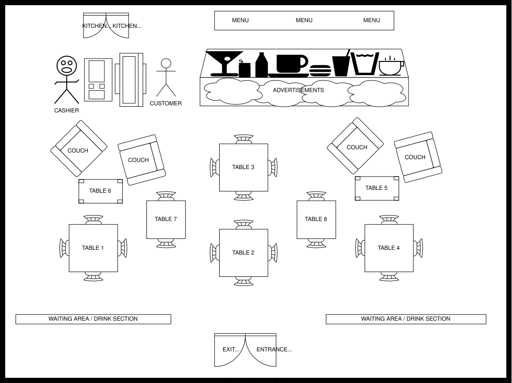
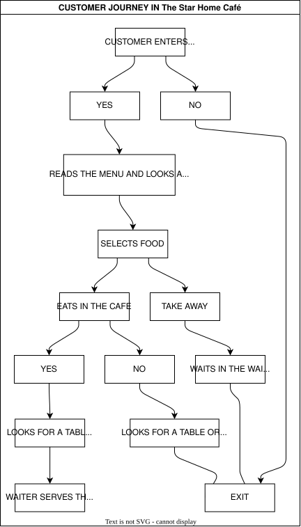

----

_To maintain confidentiality and internal security protocols, specific entity names and geographic locations have been replaced with descriptive architectural identifiers throughout this document._

----

## **Cognitive Ergonomics & Spatial UX: An Ethnographic Case Study**

### Introduction

People all over the world consume coffee everyday; it is known to be the preferred drink of the civilized world.

As the world’s 104th most-traded product in 2022, coffee reached a total trade value of 45.4 billion, encompassing roasted, unroasted, decaffeinated, and substitute varieties. This sector, which accounts for 0.19% of total world trade, saw exports surge by 24.9% between 2021 and 2022 and by 32.82% since 2018. While global production rose slightly to 168.2 million bags, geographical shifts occurred; adverse weather caused declines in Asia and Africa, but South America—the largest exporting region—experienced a 4.8% increase fueled by Brazil’s 8.86 billion in exports. Vietnam and Colombia followed as top exporters with 3.37 billion and 4.15 billion respectively, while North America led as the top importing region, with the United States alone representing 19.6% of the market at 8.89 billion. Despite its high trade volume, coffee maintains a modest rank of 956th on the Product Complexity Index (PCI) ([Li2026](References.md#Li2026)).

Café is location that is main business function is to serve coffee, tea with various other hot and cold beverages. Although recently most cafes now serve light snacks alongside these beverages including refreshments such as ice tea and drinks. Cafés are mostly known to be small enterprises but it goes up to global corporation such as Costa Coffee with worldwide and well reputable coffee shop chains.

Cafés are known to originate from the western culture but in truth it was cultivated in Africa and was introduced into England by the Muslims via the trade routes of the Mediterranean Sea. Queen Elizabeth 1 established diplomatic relations with the Moroccans and Ottomans, resulting in further imports on goods like tea from Asia, coffee and chocolate leading us to the fact that the Middle East had coffeehouses way before England had established one.

The first official coffeehouse known as “The Turk’s Head” or “Rosee’s coffee-house” was opened in the year 1652 in London by a servant called Pasqua Rosee and an immigrant Ottoman Smyrna located at St Michael’s Alley Cornhill, serving mostly merchants of the Ottoman Empire.

The Coffeehouses back then where viewed as places where unfaithful Christians assemble people fascinated by the arts and cultures ranging from the Middle East to the Orients. Along the line the number of coffeehouses increased to over 83 from 1663, and famous people began to gain interest in these establishments such as Baron Charles Louis von Pollnitz quoted “It is one of the great pleasures of the city, a rule with the English, to go once a day at least to engage in
conversations of business, news, reading papers and gazing at each other. Being accepted in England, Lloyds of London started first English owned coffeehouse on Tower Street in the year 1688.

Today they are no longer called coffeehouses but cafés or coffee shop, anywhere around the world if you mention coffee first thing that comes to mind is Starbucks and it is a brand developed in the western world.

Coffee shop in Africa is considered an unusual trend, that has been introduced mostly by Africans who studied or worked abroad and this has resulted in an increase in the exports of coffee-producing countries, demands in the coffee market and establishment of cafes in major cities.

Take for example Café Neo a well-known Nigerian brand which has made a reputation for itself across major cities in Nigeria, Kenya’s astonishing Java House Coffee and Art Caffe have been competing all over Nairobi. Coffee drinking became a thing of fashion in Cape Town of South Africa. Amidst all this Africa is acknowledged for about 13 per cent of the world’s supply taking into thought that it originated from Africa, even at that note it was commonly found in the North Africa and Ethiopia.

Algeria was identified as the only African country to be found on top 20 countries with high coffee consumption which buttresses the fact that Northern countries have been dealing with coffee for years.

It has been speculated that the consumption of coffee is expected to rise to over 200 million bags by the year 2030 resulting in a 30 percent growth in consumption rate; this can be done through an escalation in coffee producers output in the next ten years to meet up the rising demand.

### Background

The rapid expansion of mobile technology and the increasing personal wealth of individuals have made a daily cup of coffee nearly indispensable in modern life. This shift provides the context for our examination of The Star Home Café, a specialized dining environment that blends a restaurant and coffee shop atmosphere. This establishment is situated within Joyful Mall in Accra, Ghana—a venue founded in 2005 that stands as one of the most established and commercially prominent landmarks on Mighty Galaxy street.

The founder launched this venture on November 16, 2015, driven by a deep-seated passion for coffee; already an owner of multiple businesses, he sought to create a personal sanctuary that could simultaneously function as a professional hub. While originally intended to serve strictly premium coffee blends and light snacks, the business evolved into a full-scale restaurant to accommodate local preferences, specifically the Ghanaian affinity for rice dishes as a complement to coffee. The choice of Joyful Mall as a location was strategic, targeting a commercially vibrant area frequented by middle-class patrons. Furthermore, because Star Home Café operates within a campus-integrated setting, its primary clientele consists of students, faculty, and various shoppers visiting the Joyful Mall vicinity.

### Ethnographic Data Collection

Observational and interview-based techniques constitute essential skills within user research. Observation involves monitoring participant behavior through either overt methods, where subjects are aware of the study, or covert methods, where the researcher integrates into the group without disclosing their identity. Generally, these methods are cost-effective and require minimal resources; however, they necessitate institutional permission and cooperation, and can often be time-consuming or longitudinal in nature.

As these techniques are foundational to any study, they were central to our research. We were required to secure permissions from the target establishment, which involved overcoming initial skepticism; the management was surprised that Computer Science researchers were conducting ethnographic research, as they associated such studies primarily with business and marketing disciplines. After two days of negotiation, we were granted access and found the manager and staff to be highly hospitable and cooperative. My team and I conducted a two-day observation and a formal interview with the manager. The interview took place on 21/11/2023, followed by the first observation from 12:00pm to 2:00pm on 22/11/2023, and a second session from 3:00pm to 4:00pm on 27/11/2023—all held at Star Home Café in Joyful Mall. To facilitate subsequent analysis and note-taking, a sketch of the Star Home Café layout was also created.

### Observation

We began with a 15-minute general assessment to familiarize ourselves with the overall atmosphere. The interior was well-designed and climate-controlled via air conditioning, though we identified specific ergonomic issues regarding the seating in the dining area. We observed distinct behavioral patterns among customers at various tables: some patrons would order at the counter, locate a seat, and wait for their food to be served before paying, while others preferred to pay immediately before dining.

Usage patterns shifted based on the time of day: during the lunch rush (12:00pm to 3:00pm), customers typically paired tea or soft drinks with a meal or opted for takeout, whereas during the late afternoon (3:00pm to 5:00pm), the atmosphere became more relaxed as patrons favored coffee or tea accompanied by pastries. Hygiene was a clear priority for the establishment. Kitchen staff adhered to safety protocols by wearing aprons, gloves, and caps. Simultaneously, the waitstaff maintained the dining floor by cleaning, sweeping, and mopping around tables immediately after each use. More intensive cleaning of windows, doors, and shelves was conducted during the quieter morning and evening hours. To systematically analyze these observations, I developed a logical customer journey diagram.

Then we further narrowed the focus on observing three major tasks namely: place an order, service duration and bill payment.

Lets look at the tasks in detail:-

#### Place an Order

The majority of patrons utilized the establishment's free Wi-Fi, arriving with laptops and various electronic devices. Ordering was typically efficient; many customers skimmed the menu quickly, while regulars—including researchers, faculty, and frequent passers-by—were already familiar with the offerings and ordered immediately upon reaching the counter. Some frequent visitors even placed orders via telephone prior to their arrival to minimize wait times.

During our study, we observed a patron clearly enjoying a meal of fried rice and chicken; when asked about the quality of the food, he enthusiastically confirmed it was delicious. He expressed interest in our presence, allowing us to explain the nature of our research project. During our second observation in the evening, we noted an elderly couple who spent considerable time examining the pastry display. Despite the premium pricing on small items, they eventually selected a red velvet cake, located a table, and waited quietly for a waiter to serve them.

#### Service Duration

The waitstaff maintained a polite demeanor while attending to each table. During the afternoon, a situation occurred where a customer received an incorrect order of jollof rice and chicken instead of the French fries and chicken he had requested. The customer, clearly confused, signaled the waiter to lodge a complaint.

The waiter, who was only on his second day of employment, offered an immediate apology and returned to the kitchen; within one minute, he reappeared with the correct meal. The patron, appearing quite hungry, consumed the food quickly without further comment. Upon finishing, he left a tip of 10 bucks for the waiter and departed. The waiter expressed deep gratitude, experiencing a visible mixture of relief and lingering anxiety following the interaction.

#### Bill Payment

The process for settling bills varies among patrons. Because the establishment functions as both a coffee shop and a restaurant, customers have the flexibility to pay either immediately after ordering or once they have finished their meal. Transactions are typically conducted using cash. Furthermore, a 15% discount is available for researchers during lunch hours, provided they present a valid ID card. Despite the consistent presence of crowds, the cashier maintains enough efficiency to manage all transactions effectively.

#### Interview

On 21/11/2023, an interview was conducted with the manager, Mr. Daniel, of Star Home Café in Joyful Mall to collect primary research data.

##### Brief History

The name originates from a specific type of coffee bean known for its sweet aroma, which traces its roots to Yemen and was historically produced in Reunion. Star Home Café commenced operations on November 16, 2015. Currently, it operates a single station in Ghana. While living in the UK, Mr. Daniel developed a deep appreciation for refined, well-brewed coffee, which inspired him to bring this high-standard service to Ghana. This personal passion led to the creation of the shop; though it began strictly as a coffee-focused establishment, it has since expanded into a full-service restaurant.

###### Area

Star Home Café is situated near Joyful Mall on mighty galaxy street in Accra. This specific site was selected to attract middle class patrons and upper-class patrons seeking professional coffee breaks paired with quality meals. Despite being located in a highly competitive commercial hub—surrounded by eateries such as Coffee Crown, Burger and Enjoy, Eat Now restaurant, Cafe Mundo, and Chickenlicious — Star Home remains a top choice. It distinguishes itself through a climate-controlled, relaxed interior featuring television for entertainment and free Wi-Fi, which specifically attracts researchers. The space is intentionally designed to serve both as a professional meeting venue and a comfortable dining environment.

###### Culture

The establishment opens daily at 7:00 am. Staff and cooks arrive early to prepare for the morning rush, as many customers visit for coffee and breakfast. The team consists of nine employees working in shifts to cover the busy breakfast and lunch periods. While activity tapers off in the late afternoon, the staff uses this time to prepare for the dinner rush before closing at 10:00 pm. A unique culinary draw is their jerk chicken, a dish rarely found in other local eateries.

Despite its success, the business faces challenges, specifically the need for more space; the restaurant often reaches full capacity, leading to a loss of potential customers. Additionally, wait times can be a factor, occasionally causing researchers to miss scheduled commitments. Future goals include expanding with a branch in other areas in Ghana. Notably, a home delivery service was launched approximately six weeks ago, and hopes for better customer satisfaction.

## Conclusion

In conclusion, the research conducted through observations and interviews at Star Home Café was highly productive, yielding significant insights and interpretations that could enhance similar environments. Our findings highlighted several areas requiring further analysis, interpretation, and potential design intervention.

### Observations Requiring Further Analysis

* **Variations in Payment Timing:** Why do payment behaviors differ among patrons? Some chose to pay immediately upon ordering, while others settled the bill after dining. Researchers often displayed their ID cards proactively to the cashier, whereas shoppers from Joyful Mall and general passers-by typically prepared their wallets as soon as they entered.
* **Queue Behavior and Social Interaction:** What activities do patrons engage in while waiting in line, and are there ways to make this time more productive? Furthermore, there is a notable lack of interaction, such as greetings, between strangers in crowded areas.
* **Seating Preferences:** Why do some customers opt for takeout or leave the premises entirely if a completely unoccupied table is unavailable?

### Interpretations and Assumptions

* **Social Boundaries and Technology:** It appears patrons prefer to use their waiting time independently. They seem reluctant to interact with strangers during short intervals, likely because they are accustomed to using their mobile devices as a primary distraction.
* **Table Privacy:** There is a clear preference against sharing tables with unfamiliar individuals.
* **Resource Constraints:** While the management of Star Home Café acknowledges the limited seating capacity, there is an opportunity to expand by introducing outdoor seating, effectively utilizing exterior space for catering.
* **Research Scope:** Additional observation sessions could have provided an even more comprehensive perspective on these behaviors.

### Design Opportunities

* **Efficiency for Academic Patrons:** How can the ordering process be optimized to better serve researchers and campus-based individuals, particularly during limited breaks?
* **Value-Added Waiting:** In what ways can the waiting period be redesigned to be more meaningful or effective for the customer?
* **Space Optimization and Interaction:** How can the seating layout be re-engineered to maximize space efficiency? Additionally, are there design strategies that could naturally encourage more social interaction among patrons?

## Theory Building

(i) During the initial day of observation, the establishment had only seven tables occupied, yet a significant queue had formed. We noted that several potential patrons, upon seeing the crowd, anticipated a delay in service and chose to leave. While more patient customers remained in line to wait for their takeaway orders, this overall bottleneck suggests a reduction in potential work output and lost service opportunities.

(ii) A high level of satisfaction was observed among patrons regarding the quality of both meals and hot beverages. Most frequent visitors maintained a satisfied expression during and after their dining experience. Furthermore, the comfortable climate-controlled interior, complemented by the paintings and photographs on the walls, serves as a strong draw for clientele, which directly translates to increased business for the café.

(iii) The establishment maintains rigorous hygiene standards, with kitchen staff utilizing aprons, gloves, and caps. To ensure the environment remains ready for subsequent use, waiters promptly clean tables and perform floor maintenance after each customer departs. Operations are managed through a structured shift system; for instance, the morning shift consists of three waiters and a kitchen team, with a similar staffing level maintained throughout the afternoon and evening. These organized operational criteria are designed to maximize work output.

## References

* Li, Xia, Bulitia Godrick, Tinega Nyamoko Joseph, and Fengting Li. 2026. “An Overview of Carbon Footprint Reduction in the Global Coffee Trade: Sustainable Production, Consumption.” Applied Food Research 6 (1): 101716. <https://doi.org/https://doi.org/10.1016/j.afres.2026.101716>
